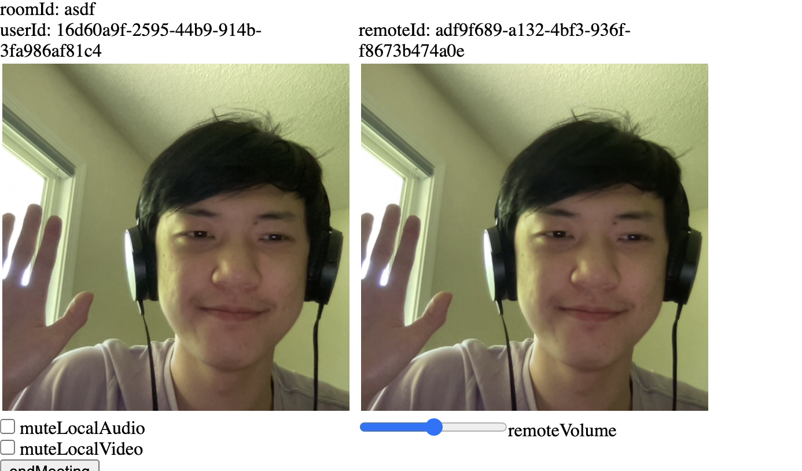
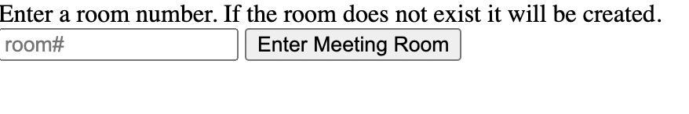

<!-- ABOUT THE PROJECT -->
## Simple Meetings App



This is a simple web meeting application used for video and audio communication. Utilizing WebRTC along with PeerJS, users can communicate with each other easily in a meeting up to ten people. Example hosted on heroku: https://simple-meeting.herokuapp.com/

Important: Currently many web browsers requires a secure-context to access the MediaDevices API. As a result, in order to fully run this application locally, you need to set the chrome://flags/#unsafely-treat-insecure-origin-as-secure and provide the HTTP address. However, you can still go to the heroku-hosted website and see your own video in an empty room, but others cannot join and see your video and audio.

Features:
* Video and audio meeting for up to ten people
* Create custom room names that others can easily join
* Mute local audio and video if you're not comfortable
* Change the volume of other participants in the meeting

### Built With

This project primarly uses a couple of libraries to establish communication and get media devices. PeerJS provides free Peerservers to connect to, and WebRTC allows streaming of video and audio over the internet. Socket.io allows real-time bi-directional event-based communication, simplifying the whole communication process.
* [Socket.io](https://socket.io/)
* [PeerJS](https://peerjs.com/)
* [WebRTC](https://webrtc.org/)

<!-- GETTING STARTED -->
## Getting Started

To run the server locally and start setting up some meeting rooms, follow these simple example steps.

### Prerequisites

* Install npm and nodejs and all the dependencies of this project
  ```sh
  $ brew install node
  ```

### Run the server

1. Download the files, install dependencies, and start the server using
  ```sh
  $ npm install
  $ node app.js
  ```
2. Open your browser and navigate to http://127.0.0.1:4000/
   
3. Enter any room name to create a room

4. Others can now join the room using the room name!

## Example Images



